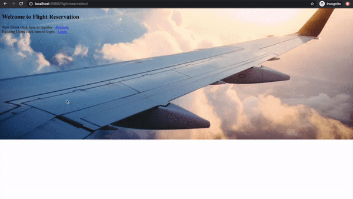
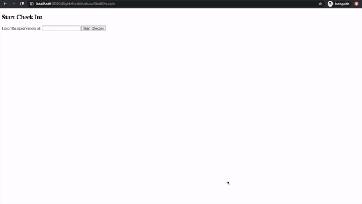

# Flight Reservation and Check In System

Spring Boot Suits, MySQL(MySQLWorkbench)

## Usage

run

`java -jar flightreservation-0.0.1-SNAPSHOT.jar` at localhost:8080/flightreservation

run 

`java -jar flightcheckin-0.0.1-SNAPSHOT.jar` at localhost:9090/flightcheckin/showStartCheckin

## Demos

The demo of using flight reservation web application

The demo of using flight checkin application

## Database configurations

run `reservation.sql`

run `flights.sql`

run `roles.sql`

